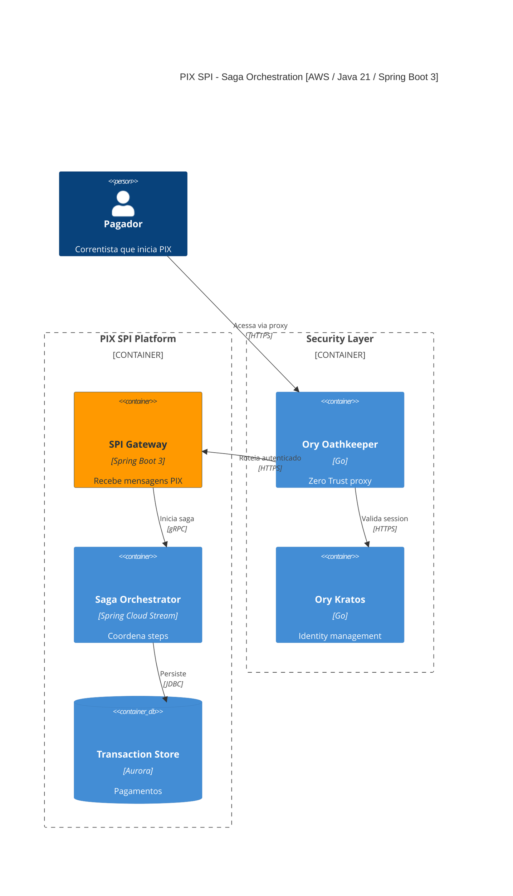

# CLAUDE.md

> **Regra:** Todo prompt, melhoria ou instrução criada pelo usuário deve ser salvo neste arquivo CLAUDE.md para persistir entre sessões.

---

# Plano: Gerador de Cenarios de Arquitetura Fintech em Mermaid C4

## Contexto
Criar entre 2000 e 5000 arquivos Mermaid com diagramas C4 (Context, Container, Component) para cenarios de arquitetura de fintechs, cobrindo 4 plataformas cloud (AWS, Azure, GCP, Oracle Cloud), integrações regulatorias do BACEN (RSFN, DICT, MED, TEF, STR, DDA), enterprise integration patterns, design patterns, e múltiplas linguagens (Java/Spring Boot, Go, .NET, Python, Node.js).

## Requisito: Arquiteturas de Solução Únicas

**Cada arquivo `.mmd` deve representar um projeto de arquitetura de solução único e realista.** Não basta variar labels — cada diagrama deve contar uma história arquitetural diferente:

### Cenários Simples (1-3 integrações)
- Microserviço único processando PIX com SQS e Aurora
- API REST com circuit breaker chamando serviço externo BACEN
- Worker consumindo fila DLQ e gravando em DynamoDB
- Webhook receiver com rate limiting e persistência

### Cenários Médios (4-6 integrações)
- Orquestração Saga para transferência interbancária com 3 participantes
- Pipeline de anti-fraude com ML scoring, rule engine e case management
- CQRS com event store, projeções read-model e notificações async
- Open Banking consent flow com FAPI auth, token management e data sharing

### Cenários Complexos (7+ integrações)
- Plataforma PIX completa: SPI Gateway + DICT + MED + Settlement + Liquidity + Anti-Fraud + Reconciliation
- Core Banking end-to-end: Account opening + KYC + Ledger + Payments + Cards + Notifications + Observability
- Data Lake fintech: CDC ingestion + Stream processing + Transformation + Quality + Catalog + Analytics + ML
- Ecossistema Open Finance: Consent + APIs Phase 1-4 + Payment Initiation + Directory + Webhooks + Audit

### O que torna cada diagrama único:
1. **Fluxo de dados diferente** — caminhos de integração distintos entre componentes
2. **Combinação de padrões** — cada cenário usa mix diferente de EIP + Design Patterns
3. **Profundidade variável** — de 3 componentes (simples) a 15+ componentes (complexo)
4. **Integrações regulatórias específicas** — DICT API, MSG PIX, RSFN XML, ISO 8583, CNAB, SCR
5. **Trade-offs arquiteturais** — sync vs async, SQL vs NoSQL, monolito vs micro, REST vs gRPC vs messaging
6. **Cenários de falha** — circuit breakers, retries, DLQ, compensação, fallback
7. **Descrições contextuais** — cada elemento tem descrição que explica seu papel único no cenário

## Requisito: Open Policy Agent (OPA) nas Arquiteturas

**Todos os diagramas devem incluir o Open Policy Agent (OPA) como componente de autorização e enforcement de políticas.** O OPA é um policy engine open-source que unifica policy enforcement em toda a stack, usando a linguagem declarativa Rego.

### Cenários de Uso do OPA em Fintech

| Cenário | Descrição | Exemplo Rego |
|---------|-----------|--------------|
| **API Authorization** | Autorização de requests HTTP via REST API OPA (`POST /v1/data/authz`) | `allow if { input.method == "GET"; token.payload.role == "admin" }` |
| **RBAC/ABAC** | Controle de acesso baseado em roles e atributos para operações financeiras | `allow if { user_roles[input.user][_] == "trader"; input.amount <= 2000000 }` |
| **Transaction Policy** | Validação de limites de transação, horários permitidos, AML rules | `allow if { input.amount <= user_limit; not is_sanctioned(input.beneficiary) }` |
| **Data Access Control** | Controle de acesso a dados sensíveis (PIX, DICT, dados cadastrais) | `allow if { input.path == ["pix", "keys"]; has_consent(input.user) }` |
| **Compliance Rules** | Regras regulatórias BACEN, COAF, LGPD enforcement | `deny if { not input.request.has_consent; input.data_type == "personal" }` |
| **Kubernetes Admission** | Validação de deployments (registries permitidos, labels obrigatórios) | `deny if { not startswith(container.image, "registry.internal/") }` |

### Padrões de Deploy do OPA

1. **Sidecar** — OPA como container sidecar no mesmo pod (baixa latência, fault-tolerant)
   - Usado com Envoy proxy para L7 policy enforcement (`envoy_ext_authz_grpc`)
   - Ideal para microserviços com decisões de autorização frequentes
   - Portas: `8181` (REST API), `9191` (gRPC Envoy)

2. **Centralized OPA Service** — OPA como serviço centralizado com Bundle API
   - Policy bundles distribuídos via `GET /v1/bundles`
   - Decision logs centralizados via `POST /logs` (gzip compressed JSON)
   - Health check: `GET /health?bundle=true`

3. **API Gateway Integration** — OPA como external authorizer do API Gateway
   - API Gateway chama OPA antes de rotear request ao backend
   - Input: method, path, headers, JWT claims
   - Output: allow/deny + reason

### Integração nos Diagramas C4

#### C4Context
```
System(opa_engine, "OPA Policy Engine", "Open Policy Agent para authorization e compliance", $sprite="img:...")
Rel(api_gw, opa_engine, "Consulta policy decision", "REST/gRPC")
Rel(opa_engine, policy_store, "Carrega policy bundles", "HTTPS")
```

#### C4Container
```
Container(opa_sidecar, "OPA Sidecar", "OPA v1.x + Rego", "Policy engine sidecar para authorization e compliance", $sprite="img:...")
Container(opa_bundle_svc, "Policy Bundle Service", "OPA Bundle API", "Distribui policy bundles para agentes OPA", $sprite="img:...")
ContainerDb(policy_store, "Policy Store", "S3/GCS/Blob", "Armazena Rego policies e data bundles")
ContainerDb(decision_log_store, "Decision Log Store", "ElasticSearch/CloudWatch", "Armazena decision logs para auditoria")
Rel(main_svc, opa_sidecar, "Consulta authorization", "localhost:8181")
Rel(opa_sidecar, policy_store, "Carrega bundles", "HTTPS")
Rel(opa_sidecar, decision_log_store, "Envia decision logs", "HTTPS/gzip")
```

#### C4Component
```
Component(policy_evaluator, "Policy Evaluator", "OPA REST Client", "Consulta OPA para decisões de autorização")
Component(rego_policies, "Rego Policies", "Rego", "Regras RBAC/ABAC, limites transacionais, compliance BACEN")
Component(decision_logger, "Decision Logger", "OPA Decision Logs", "Registra decisões para auditoria regulatória")
```

### Cenários OPA por Domínio

| Domínio | Policy OPA | Descrição |
|---------|-----------|-----------|
| `pix-dict` | Key Registration Policy | Valida permissão para registrar/alterar chaves por tipo e titular |
| `pix-spi` | Transaction Limit Policy | Enforce limites de transação PIX (diário, mensal, por tipo) |
| `pix-med` | Refund Authorization Policy | Valida elegibilidade de caso MED e prazo regulatório |
| `open-banking` | Consent Verification Policy | Verifica consent do titular antes de compartilhar dados |
| `core-banking` | Account Access Policy | RBAC para operações em conta (saldo, extrato, transferência) |
| `anti-fraud` | Risk Decision Policy | Avalia score de risco e decide bloqueio/liberação em real-time |
| `kyc-aml` | Sanctions Screening Policy | Verifica listas OFAC, COAF e PEP antes de autorizar operação |
| `cards` | Card Transaction Policy | Valida limites, MCC permitidos e geolocalização |
| `api-gateway` | API Rate Limiting Policy | Controla rate limits por API consumer, plano e endpoint |
| `security-iam` | Authentication Policy | Valida JWT, MFA requirements e session policies |
| `data-pipeline` | Data Access Policy | Controla acesso a dados sensíveis por classificação LGPD |
| `payments` | Payment Authorization Policy | Enforce regras de pagamento: limites, horários, beneficiários |

## Requisito: Camada de Segurança com Ory Stack

**Todos os diagramas devem incluir uma camada de segurança usando os componentes do ecossistema Ory** (open-source, cloud-native, API-first) para identity management, autenticação, autorização e zero trust.

### Componentes Ory

| Componente | Função | APIs Principais | Uso em Fintech |
|------------|--------|-----------------|----------------|
| **Ory Kratos** | Identity & User Management | `POST /self-service/registration`, `POST /self-service/login`, `GET /sessions/whoami`, `GET /identities` | Onboarding de clientes, login multi-canal (app, web, API), MFA/2FA, gestão de perfil, account recovery, verificação de email/telefone |
| **Ory Hydra** | OAuth 2.0 & OpenID Connect Server | `POST /oauth2/token`, `GET /oauth2/auth`, `GET /userinfo`, `POST /clients`, `GET /jwks/public` | Authorization Code Flow para Open Banking, Client Credentials para M2M (BACEN, CIP), FAPI compliance, JWT token issuance, consent management |
| **Ory Keto** | Permission & Access Control (Zanzibar) | `POST /relation-tuples/check`, `GET /relation-tuples/expand`, `PUT /admin/relation-tuples`, `GET /relation-tuples` | RBAC/ABAC para operações financeiras, relation tuples (user:account:owner), namespace-based permissions, hierarquia de roles |
| **Ory Oathkeeper** | Identity & Access Proxy (Zero Trust) | Access Rules (JSON/YAML), Authenticators, Authorizers, Mutators | API Gateway proxy, zero trust enforcement, request mutation (add headers/JWT), route-level authentication |

### Ory Kratos — Identity Management

Gerenciamento completo de identidade:
- **Self-service flows**: Registration, Login, Profile Settings, Account Recovery, Verification
- **Métodos de autenticação**: Password, Social Sign-In (Google, Apple), TOTP, WebAuthn/Passkeys, SMS
- **Session Management**: Cookie-based, token-based, `GET /sessions/whoami`
- **Identity Schema**: JSON Schema customizável (CPF, CNPJ, dados cadastrais BACEN)
- **MFA/2FA**: TOTP (Google Authenticator), WebAuthn (biometria), SMS codes
- **Webhooks**: Notificação de eventos de identidade (registration, login, recovery)
- **Storage**: PostgreSQL, MySQL, CockroachDB

### Ory Hydra — OAuth 2.0 Server

Servidor OAuth 2.0 e OpenID Connect certificado:
- **Authorization Code Flow**: Para apps web/mobile com PKCE
- **Client Credentials Flow**: Para comunicação M2M (serviço-a-serviço)
- **Device Authorization Flow**: Para dispositivos IoT/POS
- **FAPI Compliance**: Suporte a Financial-grade API (Open Banking Brasil)
- **JWT Bearer**: Autenticação de client via JWT signed
- **Dynamic Client Registration**: Registro automático de clients OAuth2
- **Token Management**: Access tokens, refresh tokens, ID tokens com lifespans configuráveis
- **Consent Management**: Tela de consentimento para compartilhamento de dados
- **JWKS**: `GET /.well-known/jwks.json` para verificação de tokens

### Ory Keto — Permissions (Google Zanzibar)

Sistema de permissões baseado no Google Zanzibar:
- **Relation Tuples**: `namespace:object#relation@subject` (ex: `accounts:acc123#owner@user456`)
- **Check API**: `POST /relation-tuples/check` → `{"allowed": true/false}`
- **Expand API**: `GET /relation-tuples/expand` → árvore de permissões
- **List API**: Lista objetos que um subject pode acessar
- **Namespaces**: `accounts`, `transactions`, `pix_keys`, `consents`, `documents`
- **Ory Permission Language (OPL)**: DSL para definir modelos de permissão
- **Exemplo de Relation Tuples para Fintech**:
  ```
  accounts:acc-001#owner@user-123
  accounts:acc-001#viewer@user-456
  pix_keys:key-evp-001#manager@user-123
  transactions:tx-789#approver@role:compliance-officer
  consents:consent-ob-001#grantor@user-123
  ```

### Ory Oathkeeper — Zero Trust Proxy

Identity & Access Proxy (BeyondCorp/Zero Trust):
- **Authenticators**: `oauth2_introspection`, `jwt`, `cookie_session`, `anonymous`, `noop`
- **Authorizers**: `allow`, `deny`, `keto_engine_acp_ory` (integração com Keto)
- **Mutators**: `header` (add X-User-Id), `id_token` (generate JWT), `cookie`, `noop`
- **Access Rules**: JSON/YAML definindo match URL + method → authenticator → authorizer → mutator
- **Portas**: `4455` (proxy), `4456` (API)
- **Exemplo de Rule**:
  ```json
  {
    "id": "pix-transfer-api",
    "upstream": {"url": "http://pix-spi-service:8080"},
    "match": {"url": "/api/v1/pix/transfers", "methods": ["POST"]},
    "authenticators": [{"handler": "jwt"}],
    "authorizer": {"handler": "keto_engine_acp_ory"},
    "mutators": [{"handler": "header", "config": {"headers": {"X-User-Id": "{{ print .Subject }}"}}}]
  }
  ```

### Integração Ory nos Diagramas C4

#### C4Context
```
System(ory_stack, "Ory Security Stack", "Identity, AuthN, AuthZ e Zero Trust")
System(ory_kratos, "Ory Kratos", "Identity & User Management com MFA")
System(ory_hydra, "Ory Hydra", "OAuth 2.0 & OpenID Connect Server")
Rel(user, ory_kratos, "Login/Registration", "HTTPS")
Rel(ory_kratos, ory_hydra, "Emite tokens", "OAuth2/OIDC")
Rel(api_gw, ory_stack, "Valida identidade e permissões", "HTTPS")
```

#### C4Container
```
Container(ory_kratos, "Ory Kratos", "Go", "Identity management: registration, login, MFA, recovery", $sprite="...")
Container(ory_hydra, "Ory Hydra", "Go", "OAuth 2.0 / OIDC server, token issuance, consent", $sprite="...")
Container(ory_keto, "Ory Keto", "Go", "Permission system (Zanzibar): relation tuples, check/expand API", $sprite="...")
Container(ory_oathkeeper, "Ory Oathkeeper", "Go", "Zero Trust proxy: authenticate, authorize, mutate requests", $sprite="...")
ContainerDb(identity_db, "Identity Store", "PostgreSQL", "Identidades, sessions, credentials, recovery tokens")
ContainerDb(keto_db, "Keto Store", "PostgreSQL", "Relation tuples, namespaces, permissões")
Rel(api_gw, ory_oathkeeper, "Roteia via proxy", "HTTPS")
Rel(ory_oathkeeper, ory_kratos, "Valida session", "HTTPS")
Rel(ory_oathkeeper, ory_keto, "Verifica permissão", "HTTPS")
Rel(ory_kratos, ory_hydra, "Emite tokens OAuth2", "Internal")
Rel(ory_kratos, identity_db, "Persiste identidades", "PostgreSQL")
Rel(ory_keto, keto_db, "Persiste relation tuples", "PostgreSQL")
```

#### C4Component
```
Component(identity_handler, "Identity Handler", "Ory Kratos Client", "Gerencia registration, login, session, MFA")
Component(oauth2_handler, "OAuth2 Handler", "Ory Hydra Client", "Token issuance, consent, FAPI flows")
Component(permission_checker, "Permission Checker", "Ory Keto Client", "Check/Expand API para RBAC/ABAC")
Component(access_proxy, "Access Proxy", "Ory Oathkeeper Rules", "Authenticators, authorizers, mutators")
```

### Cenários Ory por Domínio

| Domínio | Componente Ory | Cenário |
|---------|---------------|---------|
| `pix-dict` | Kratos + Keto | Autenticação do titular + verificação de permissão para registrar/alterar chave |
| `pix-spi` | Hydra + Oathkeeper | OAuth2 Client Credentials para M2M com SPI + proxy zero trust nas APIs |
| `pix-med` | Kratos + Keto | Autenticação da vítima + permissão do analista para aprovar devolução |
| `open-banking` | Hydra + Kratos | FAPI Authorization Code Flow + consent management para Open Finance |
| `core-banking` | Kratos + Keto + Oathkeeper | Login MFA do correntista + RBAC nas operações + proxy zero trust |
| `anti-fraud` | Keto + Oathkeeper | Permissões do analista por nível de alçada + proxy nas APIs internas |
| `kyc-aml` | Kratos + Keto | Onboarding com verificação de identidade + permissão para acessar dados PLD |
| `cards` | Hydra + Oathkeeper | OAuth2 para tokenização + proxy zero trust nas APIs de cartão |
| `api-gateway` | Oathkeeper + Hydra | Zero trust proxy + OAuth2 token validation para APIs externas |
| `security-iam` | Kratos + Hydra + Keto + Oathkeeper | Stack Ory completa como backbone de identidade e segurança |
| `data-pipeline` | Keto | Permissões granulares de acesso a datasets e tabelas (LGPD) |
| `payments` | Hydra + Keto | OAuth2 para integrações de pagamento + permissões por tipo de operação |
| `insurance` | Kratos + Hydra | Autenticação de segurado/corretor + OAuth2 para APIs SUSEP |
| `investments` | Keto + Oathkeeper | Permissões por perfil de investidor (suitability) + proxy zero trust |

### Relação OPA + Ory Stack

O **OPA** e o **Ory Stack** são complementares:
- **Ory Kratos**: Gerencia *quem é* o usuário (identity, authentication)
- **Ory Hydra**: Gerencia *tokens* e *consent* (OAuth2/OIDC)
- **Ory Keto**: Gerencia *quem pode acessar o quê* (permissions, relation tuples)
- **Ory Oathkeeper**: *Aplica* as decisões na camada de rede (zero trust proxy)
- **OPA**: *Avalia regras de negócio complexas* em Rego (limites transacionais, compliance BACEN, AML screening)

Fluxo típico: Request → **Oathkeeper** (proxy) → **Kratos** (session) → **Keto** (permission) → **OPA** (business policy) → Service

## Requisito: Observabilidade com Datadog

**Todos os diagramas devem incluir uma camada de observabilidade usando Datadog** como plataforma unificada de monitoramento, APM, logs e segurança. O Datadog fornece visibilidade end-to-end em infraestrutura, aplicações e dados.

### Componentes Datadog na Arquitetura

| Componente | Função | Portas/Protocolos | Uso em Fintech |
|------------|--------|-------------------|----------------|
| **Datadog Agent** | Coleta métricas, traces e logs de hosts/containers | `8125` (DogStatsD), `8126` (APM traces), `10518` (logs) | DaemonSet em K8s, sidecar em Fargate/serverless, host-based em VMs |
| **APM (Distributed Tracing)** | Tracing distribuído end-to-end entre microserviços | Headers: `x-datadog-trace-id`, `x-datadog-parent-id` | Rastreio de transações PIX, pagamentos, transferências interbancárias |
| **Log Management** | Coleta, processamento e análise centralizada de logs | Log Pipelines, parsing, enrichment | Auditoria regulatória BACEN, COAF, LGPD, trilha de auditoria |
| **Infrastructure Monitoring** | Métricas de hosts, containers, serviços cloud | DogStatsD custom metrics (counters, gauges, histograms) | Monitoramento de SLAs BACEN (PIX 10s, STR real-time), health de infra |
| **Data Streams Monitoring** | Latência e throughput de pipelines de dados | `data_streams.latency`, `data_streams.kafka.lag_seconds` | Monitoramento de filas PIX, Event Sourcing, CDC pipelines |
| **Cloud SIEM** | Detecção de ameaças e compliance de segurança | TTD, TTA, TTR metrics | Detecção de fraude em real-time, compliance PCI-DSS, alertas de segurança |
| **RUM (Real User Monitoring)** | Performance do frontend e experiência do usuário | Correlação RUM-to-APM traces | Internet Banking, App Mobile, Portal Open Banking |
| **Synthetic Monitoring** | Testes proativos de APIs e fluxos críticos | API tests, Browser tests com APM trace linking | Health check de APIs BACEN (DICT, SPI, STR), SLA monitoring |
| **Dashboards & Alerts** | Visualização e alertas customizados | Monitors, SLOs, Composite Monitors | Dashboards de transações PIX, alertas de circuit breaker, SLO compliance |

### Padrões de Deploy do Datadog Agent

1. **DaemonSet (Kubernetes)** — Agent em cada node do cluster
   ```yaml
   apiVersion: apps/v1
   kind: DaemonSet
   metadata:
     name: datadog-agent
   spec:
     template:
       spec:
         containers:
         - name: agent
           image: gcr.io/datadoghq/agent:latest
           env:
           - name: DD_API_KEY
             value: "<DD_API_KEY>"
           - name: DD_APM_ENABLED
             value: "true"
           - name: DD_LOGS_ENABLED
             value: "true"
           - name: DD_LOGS_CONFIG_CONTAINER_COLLECT_ALL
             value: "true"
   ```

2. **Sidecar (Fargate/Serverless)** — Agent como container sidecar no pod
   - Ideal para EKS Fargate, Cloud Run, App Service
   - Porta 8126 para APM, 8125 para DogStatsD

3. **Cluster Agent** — Componente centralizado para métricas de cluster
   - Coleta métricas do Kubernetes API server
   - Distribui checks entre Agents via Cluster Checks Runners
   - External Metrics Provider para HPA baseado em métricas Datadog

### Bibliotecas de Tracing por Stack

| Stack | Biblioteca | Auto-instrumentação |
|-------|-----------|---------------------|
| Java / Spring Boot | `dd-trace-java` | HTTP (Spring MVC/WebFlux), JDBC, JMS, gRPC, Kafka, Redis |
| Go / gRPC | `dd-trace-go` | HTTP (Gin, net/http), gRPC, database/sql, Redis, Kafka |
| .NET / ASP.NET Core | `dd-trace-dotnet` | ASP.NET Core, Entity Framework, HttpClient, gRPC, RabbitMQ |
| Python / FastAPI | `dd-trace-py` | FastAPI, SQLAlchemy, Celery, aiohttp, Kafka, Redis |
| Node.js / NestJS | `dd-trace-js` | Express, NestJS, pg, ioredis, amqplib, Kafka |

### Integração nos Diagramas C4

#### C4Context
```
System(datadog_platform, "Datadog", "Plataforma de observabilidade: APM, Logs, Metrics, SIEM", $sprite="img:...")
Rel(main_system, datadog_platform, "Envia métricas, traces e logs", "HTTPS/Agent")
Rel(datadog_platform, ops_team, "Alertas e dashboards", "Webhooks/PagerDuty")
```

#### C4Container
```
Container_Boundary(obs0, "Observability Layer") {
    Container(dd_agent, "Datadog Agent", "DaemonSet", "Coleta métricas, traces e logs de todos os containers", $sprite="img:...")
    Container(dd_apm, "APM Tracer", "dd-trace-{lang}", "Distributed tracing com auto-instrumentação", $sprite="img:...")
    Container(dd_logs, "Log Forwarder", "Datadog Agent", "Coleta e envia logs para Datadog Log Management", $sprite="img:...")
}
System_Ext(datadog_platform, "Datadog Platform", "SaaS: APM, Logs, Metrics, Dashboards, Alerts")
Rel(main_svc, dd_apm, "Envia traces", "localhost:8126")
Rel(main_svc, dd_agent, "Envia métricas", "localhost:8125/DogStatsD")
Rel(dd_agent, datadog_platform, "Forwarda telemetria", "HTTPS")
Rel(dd_logs, datadog_platform, "Forwarda logs", "HTTPS")
```

#### C4Component
```
Component(dd_tracer, "DD Tracer", "dd-trace-{lang}", "Instrumentação automática de spans para HTTP, gRPC, DB, Queue")
Component(dd_metrics_client, "Metrics Client", "DogStatsD Client", "Emite custom metrics: counters, gauges, histograms, distributions")
Component(dd_log_enricher, "Log Enricher", "Datadog Log Correlation", "Injeta trace_id e span_id nos logs para correlação APM-Logs")
```

### Métricas Customizadas por Domínio

| Domínio | Métricas Datadog | Descrição |
|---------|-----------------|-----------|
| `pix-dict` | `pix.dict.key_registration.count`, `pix.dict.key_lookup.latency` | Contagem de registros e latência de consulta de chaves |
| `pix-spi` | `pix.spi.transaction.count`, `pix.spi.settlement.latency`, `pix.spi.rejection.rate` | Volume de transações, tempo de liquidação, taxa de rejeição |
| `pix-med` | `pix.med.refund.count`, `pix.med.dispute.resolution_time` | Devoluções processadas, tempo de resolução de disputas |
| `core-banking` | `banking.account.operations.count`, `banking.ledger.balance.gauge` | Operações em conta, saldo contábil |
| `anti-fraud` | `fraud.score.distribution`, `fraud.blocked.count`, `fraud.false_positive.rate` | Distribuição de scores, bloqueios, falsos positivos |
| `payments` | `payment.processed.count`, `payment.latency.p99`, `payment.failure.rate` | Pagamentos processados, latência P99, taxa de falha |
| `open-banking` | `openbanking.consent.count`, `openbanking.api.latency`, `openbanking.data_sharing.volume` | Consents emitidos, latência de API, volume de dados |
| `cards` | `cards.transaction.count`, `cards.authorization.latency`, `cards.decline.rate` | Transações de cartão, latência de autorização, taxa de declínio |
| `kyc-aml` | `kyc.verification.count`, `aml.screening.latency`, `aml.alerts.count` | Verificações KYC, latência de screening, alertas AML |
| `data-pipeline` | `pipeline.records.throughput`, `pipeline.lag.seconds`, `pipeline.errors.count` | Throughput, lag de consumidor, erros de processamento |
| `reconciliation` | `recon.matched.count`, `recon.discrepancy.count`, `recon.latency` | Registros reconciliados, discrepâncias, tempo de reconciliação |
| `notification` | `notification.sent.count`, `notification.delivery.latency`, `notification.failure.rate` | Notificações enviadas, tempo de entrega, taxa de falha |

### SLOs Datadog para Fintech

| SLO | Target | Métrica |
|-----|--------|---------|
| PIX Transaction Latency | 99.9% < 10s | `pix.spi.transaction.latency` |
| API Availability | 99.95% uptime | `http.requests.errors / http.requests.total` |
| Fraud Detection Latency | 99% < 500ms | `fraud.score.latency` |
| Settlement Completion | 99.9% success | `pix.spi.settlement.success_rate` |
| Log Ingestion | 100% coverage | `datadog.logs.ingested.count` |

### Relação Datadog + OPA + Ory Stack

O **Datadog** monitora toda a stack, incluindo OPA e Ory:
- **OPA Decision Logs** → Datadog Log Management para auditoria de policy decisions
- **Ory Kratos/Hydra** → APM traces de authentication/authorization flows
- **Ory Oathkeeper** → Métricas de requests autenticados/rejeitados via DogStatsD
- **Ory Keto** → Latência de permission checks via APM spans
- Fluxo: Request → **Oathkeeper** (trace start) → **Kratos** (auth span) → **Keto** (perm span) → **OPA** (policy span) → **Service** (business span) → **Datadog** (correlação end-to-end)

## Requisito: Ícones das Cloud Providers

Os diagramas devem usar o parâmetro `$sprite` do Mermaid C4 para representar ícones das clouds e o `$tags` para estilização visual por provider.

### Sintaxe de Sprites em C4

Mermaid C4 suporta sprites via parâmetro opcional nos elementos:
```
System(id, "label", "desc", $sprite="img:https://icon-url", $tags="aws")
Container(id, "label", "tech", "desc", $sprite="img:https://icon-url", $tags="azure")
Component(id, "label", "tech", "desc", $sprite="img:https://icon-url", $tags="gcp")
```

### Mapeamento de Ícones por Cloud

#### AWS Icons (via official AWS Architecture Icons)
| Serviço | Sprite |
|---------|--------|
| Lambda | `$sprite="img:https://icon.icepanel.io/AWS/svg/Compute/Lambda.svg"` |
| ECS | `$sprite="img:https://icon.icepanel.io/AWS/svg/Containers/Elastic-Container-Service.svg"` |
| EKS | `$sprite="img:https://icon.icepanel.io/AWS/svg/Containers/Elastic-Kubernetes-Service.svg"` |
| SQS | `$sprite="img:https://icon.icepanel.io/AWS/svg/App-Integration/Simple-Queue-Service.svg"` |
| SNS | `$sprite="img:https://icon.icepanel.io/AWS/svg/App-Integration/Simple-Notification-Service.svg"` |
| EventBridge | `$sprite="img:https://icon.icepanel.io/AWS/svg/App-Integration/EventBridge.svg"` |
| Kinesis | `$sprite="img:https://icon.icepanel.io/AWS/svg/Analytics/Kinesis.svg"` |
| Aurora | `$sprite="img:https://icon.icepanel.io/AWS/svg/Database/Aurora.svg"` |
| DynamoDB | `$sprite="img:https://icon.icepanel.io/AWS/svg/Database/DynamoDB.svg"` |
| ElastiCache | `$sprite="img:https://icon.icepanel.io/AWS/svg/Database/ElastiCache.svg"` |
| S3 | `$sprite="img:https://icon.icepanel.io/AWS/svg/Storage/Simple-Storage-Service.svg"` |
| API Gateway | `$sprite="img:https://icon.icepanel.io/AWS/svg/Networking-Content-Delivery/API-Gateway.svg"` |
| CloudWatch | `$sprite="img:https://icon.icepanel.io/AWS/svg/Management-Governance/CloudWatch.svg"` |
| Secrets Manager | `$sprite="img:https://icon.icepanel.io/AWS/svg/Security-Identity-Compliance/Secrets-Manager.svg"` |
| SageMaker | `$sprite="img:https://icon.icepanel.io/AWS/svg/Machine-Learning/SageMaker.svg"` |

#### Azure Icons (via official Azure Architecture Icons)
| Serviço | Sprite |
|---------|--------|
| Functions | `$sprite="img:https://icon.icepanel.io/Azure/svg/Compute/Function-Apps.svg"` |
| AKS | `$sprite="img:https://icon.icepanel.io/Azure/svg/Containers/Kubernetes-Services.svg"` |
| Service Bus | `$sprite="img:https://icon.icepanel.io/Azure/svg/Integration/Service-Bus.svg"` |
| Event Hubs | `$sprite="img:https://icon.icepanel.io/Azure/svg/Analytics/Event-Hubs.svg"` |
| SQL Database | `$sprite="img:https://icon.icepanel.io/Azure/svg/Databases/SQL-Database.svg"` |
| Cosmos DB | `$sprite="img:https://icon.icepanel.io/Azure/svg/Databases/Azure-Cosmos-DB.svg"` |
| Redis Cache | `$sprite="img:https://icon.icepanel.io/Azure/svg/Databases/Cache-Redis.svg"` |
| Blob Storage | `$sprite="img:https://icon.icepanel.io/Azure/svg/Storage/Storage-Accounts.svg"` |
| API Management | `$sprite="img:https://icon.icepanel.io/Azure/svg/Integration/API-Management-Services.svg"` |
| Key Vault | `$sprite="img:https://icon.icepanel.io/Azure/svg/Security/Key-Vaults.svg"` |
| Monitor | `$sprite="img:https://icon.icepanel.io/Azure/svg/Management-Governance/Monitor.svg"` |

#### GCP Icons (via official Google Cloud Icons)
| Serviço | Sprite |
|---------|--------|
| Cloud Run | `$sprite="img:https://icon.icepanel.io/GCP/svg/Compute/Cloud-Run.svg"` |
| GKE | `$sprite="img:https://icon.icepanel.io/GCP/svg/Containers/Google-Kubernetes-Engine.svg"` |
| Cloud Tasks | `$sprite="img:https://icon.icepanel.io/GCP/svg/App-Integration/Cloud-Tasks.svg"` |
| Pub/Sub | `$sprite="img:https://icon.icepanel.io/GCP/svg/Analytics/Pub-Sub.svg"` |
| Cloud SQL | `$sprite="img:https://icon.icepanel.io/GCP/svg/Databases/Cloud-SQL.svg"` |
| Firestore | `$sprite="img:https://icon.icepanel.io/GCP/svg/Databases/Firestore.svg"` |
| Memorystore | `$sprite="img:https://icon.icepanel.io/GCP/svg/Databases/Memorystore.svg"` |
| Cloud Storage | `$sprite="img:https://icon.icepanel.io/GCP/svg/Storage/Cloud-Storage.svg"` |
| Apigee | `$sprite="img:https://icon.icepanel.io/GCP/svg/API-Management/Apigee-API-Management.svg"` |
| Secret Manager | `$sprite="img:https://icon.icepanel.io/GCP/svg/Security/Secret-Manager.svg"` |

#### Oracle Cloud Icons (via OCI Icons)
| Serviço | Sprite |
|---------|--------|
| OCI Functions | `$sprite="img:https://icon.icepanel.io/OCI/svg/Developer-Services/Functions.svg"` |
| OKE | `$sprite="img:https://icon.icepanel.io/OCI/svg/Developer-Services/Container-Engine-for-Kubernetes.svg"` |
| OCI Queue | `$sprite="img:https://icon.icepanel.io/OCI/svg/Developer-Services/Queue.svg"` |
| OCI Streaming | `$sprite="img:https://icon.icepanel.io/OCI/svg/Developer-Services/Streaming.svg"` |
| Autonomous DB | `$sprite="img:https://icon.icepanel.io/OCI/svg/Oracle-Database/Autonomous-Database.svg"` |
| Object Storage | `$sprite="img:https://icon.icepanel.io/OCI/svg/Storage/Object-Storage.svg"` |
| OCI API Gateway | `$sprite="img:https://icon.icepanel.io/OCI/svg/Developer-Services/API-Gateway.svg"` |
| OCI Vault | `$sprite="img:https://icon.icepanel.io/OCI/svg/Security/Vault.svg"` |

### Estilização por Cloud com Tags

Usar `UpdateElementStyle` para cores que identifiquem visualmente cada cloud:
```
%% AWS - Laranja
UpdateElementStyle(aws_element, $fontColor="#232F3E", $bgColor="#FF9900", $borderColor="#232F3E")

%% Azure - Azul
UpdateElementStyle(azure_element, $fontColor="#FFFFFF", $bgColor="#0078D4", $borderColor="#002050")

%% GCP - Cores Google
UpdateElementStyle(gcp_element, $fontColor="#FFFFFF", $bgColor="#4285F4", $borderColor="#1A73E8")

%% Oracle Cloud - Vermelho
UpdateElementStyle(oci_element, $fontColor="#FFFFFF", $bgColor="#F80000", $borderColor="#C74634")
```

### Exemplo de Diagrama com Ícones (AWS)
```
C4Container
    title PIX SPI - Saga Orchestration - Container View [AWS / Java 21 / Spring Boot 3]

    Person(pagador, "Pagador", "Correntista que inicia transferência PIX")

    Container_Boundary(cb0, "PIX SPI Platform") {
        Container(spi_gw, "SPI Gateway", "Spring Boot 3", "Recebe e valida mensagens PIX ISO 20022", $sprite="img:https://icon.icepanel.io/AWS/svg/Networking-Content-Delivery/API-Gateway.svg")
        Container(payment_proc, "Payment Processor", "Spring Boot 3", "Orquestra saga de pagamento com compensação", $sprite="img:https://icon.icepanel.io/AWS/svg/Compute/Lambda.svg")
        Container(saga_orch, "Saga Orchestrator", "Spring Cloud Stream", "Coordena steps: validate, debit, credit, notify", $sprite="img:https://icon.icepanel.io/AWS/svg/App-Integration/Step-Functions.svg")
        ContainerDb(tx_store, "Transaction Store", "Aurora PostgreSQL", "Pagamentos, status, idempotency keys", $sprite="img:https://icon.icepanel.io/AWS/svg/Database/Aurora.svg")
        ContainerDb(saga_store, "Saga Store", "DynamoDB", "Estado das sagas em execução", $sprite="img:https://icon.icepanel.io/AWS/svg/Database/DynamoDB.svg")
        ContainerQueue(payment_events, "Payment Events", "SQS", "Comandos e eventos de pagamento", $sprite="img:https://icon.icepanel.io/AWS/svg/App-Integration/Simple-Queue-Service.svg")
        ContainerQueue(dlq, "Dead Letter Queue", "SQS", "Mensagens que falharam após retries", $sprite="img:https://icon.icepanel.io/AWS/svg/App-Integration/Simple-Queue-Service.svg")
    }

    System_Ext(bacen_spi, "BACEN SPI", "Sistema de Pagamentos Instantâneos do Banco Central")
    System_Ext(str, "STR", "Sistema de Transferência de Reservas para liquidação")

    Rel(pagador, spi_gw, "Inicia PIX", "HTTPS/REST")
    Rel(spi_gw, payment_proc, "Valida e encaminha", "gRPC")
    Rel(payment_proc, saga_orch, "Inicia saga", "Spring Cloud Stream")
    Rel(saga_orch, payment_events, "Publica comandos", "SQS")
    Rel(saga_orch, saga_store, "Persiste estado saga", "DynamoDB")
    Rel(payment_proc, tx_store, "Grava transação", "JDBC/R2DBC")
    Rel(spi_gw, bacen_spi, "Envia MSG PIX", "RSFN/mTLS/XML")
    Rel(payment_proc, str, "Liquida reservas", "RSFN/mTLS")

    UpdateElementStyle(spi_gw, $fontColor="#232F3E", $bgColor="#FF9900", $borderColor="#232F3E")
    UpdateElementStyle(payment_proc, $fontColor="#232F3E", $bgColor="#FF9900", $borderColor="#232F3E")
```

## Requisito: Documentação Markdown por Diagrama

**Para cada arquivo `.mmd` gerado, deve ser criado um arquivo `.md` correspondente no mesmo diretório**, com o mesmo nome base, contendo uma breve descrição do diagrama.

### Estrutura do Arquivo .md

```markdown
# {Título do Diagrama}

## Domínio
{Nome do domínio fintech} — {descrição curta do domínio}

## Cloud Provider
{AWS | Azure | GCP | Oracle Cloud}

## Nível C4
{Context | Container | Component}

## Padrão Utilizado
- **Tipo:** {EIP | Design Pattern}
- **Padrão:** {nome do padrão, ex: Content-Based Router, CQRS + Event Sourcing}

## Stack Tecnológico
{Java 21 / Spring Boot 3 | Go / gRPC | .NET 8 / ASP.NET Core | Python / FastAPI | Node.js / NestJS}
*(apenas para Container e Component)*

## Descrição
{2-4 frases descrevendo o cenário arquitetural: qual problema resolve, quais componentes principais participam, como os dados fluem, e quais integrações externas são utilizadas.}

## Componentes Principais
- **{Nome}** — {papel no cenário}
- **{Nome}** — {papel no cenário}
- ...

## Integrações Externas
- **{Sistema externo}** — {protocolo/finalidade}
- ...

## Diagrama

```

### Exemplo

Para o arquivo `pix-dict-content-based-router-context.mmd`, o arquivo `pix-dict-content-based-router-context.md` conterá:

```markdown
# Registro de Chave PIX via Content-Based Router [AWS]

## Domínio
PIX DICT — Diretório de Identificadores de Contas Transacionais

## Cloud Provider
AWS

## Nível C4
Context

## Padrão Utilizado
- **Tipo:** EIP
- **Padrão:** Content-Based Router

## Descrição
Arquitetura de registro de chaves PIX que utiliza o padrão Content-Based Router para rotear
requisições por tipo de chave (CPF/CNPJ, e-mail, telefone, EVP). O Key Router inspeciona o
payload e direciona para processadores especializados via SQS, garantindo validação específica
por tipo. Integra com BACEN DICT via mTLS para sincronização do diretório nacional.

## Componentes Principais
- **Key Router** — roteia requisições de registro por tipo de chave
- **EVP Processor** — processa chaves aleatórias EVP com UUID
- **CPF CNPJ Processor** — valida e registra chaves CPF/CNPJ com Receita Federal
- **SQS Queue** — canal de mensagens para content-based-router

## Integrações Externas
- **BACEN DICT** — HTTPS/mTLS para registro de chaves
- **Participante PSP** — HTTPS para reportar status
- **SPI** — Sistema de Pagamentos Instantâneos

## Diagrama
[Registro de Chave PIX via Content-Based Router - AWS](./pix-dict-content-based-router-context.mmd)
```

### Regras
1. O arquivo `.md` deve ter **exatamente o mesmo nome base** do `.mmd` (ex: `foo-context.mmd` → `foo-context.md`)
2. O campo **Descrição** deve ser único e contextual, explicando o cenário específico (não genérico)
3. Os **Componentes Principais** devem listar todos os sistemas/containers/componentes internos do diagrama
4. As **Integrações Externas** devem listar todos os `System_Ext` / `Container_Ext` com protocolo
5. O campo **Stack Tecnológico** só aparece em diagramas Container e Component
6. O link do diagrama deve usar caminho relativo (`./nome.mmd`)

### Requisito: Qualidade de Links nos Arquivos .md

**Todos os links nos arquivos `.md` devem ser verificados quanto à qualidade e funcionalidade.**

#### Regras de Links
1. **Usar sintaxe de link, NÃO de imagem** — `.mmd` não é imagem, usar `[texto](./arquivo.mmd)` e **NÃO** ``
2. **Evitar colchetes `[]` no texto do link** — caracteres `[` e `]` dentro do texto do link quebram o parsing Markdown. Usar parênteses ou traços em vez de colchetes (ex: `AWS / Go / gRPC` em vez de `[AWS / Go / gRPC]`)
3. **Caminho relativo obrigatório** — todos os links devem usar `./` para referenciar arquivos no mesmo diretório
4. **Arquivo referenciado deve existir** — verificar que o `.mmd` referenciado realmente existe no mesmo diretório
5. **Nome do arquivo no link deve ser exato** — incluindo extensão `.mmd`, case-sensitive

#### Verificação de Links
```bash
# Verificar links quebrados: extrair paths dos .md e checar se .mmd existe
find models -name "*.md" -exec grep -l '\.mmd)' {} \; | while read md; do
  linked=$(grep -oP '\]\(\./[^)]+\.mmd\)' "$md" | sed 's/.*(\.\///' | sed 's/)$//')
  dir=$(dirname "$md")
  if [ ! -f "$dir/$linked" ]; then
    echo "BROKEN: $md -> $linked"
  fi
done

# Verificar se há sintaxe de imagem indevida (![...] em vez de [...])
grep -rl '!\[.*\](.*\.mmd)' models/ --include="*.md" | wc -l  # deve ser 0
```

## Abordagem
Criar um **script Python gerador** (`generate_scenarios.py`) que gera sistematicamente todos os arquivos Mermaid válidos e seus arquivos `.md` de documentação, combinando domínios, clouds, níveis C4, padrões de integração e stacks tecnológicos. Meta: **~3000 diagramas + ~3000 documentações**.

## Estrutura de Diretórios
```
models/
├── {domain}/
│   ├── aws/
│   │   ├── context/
│   │   │   ├── {scenario}-context.mmd
│   │   │   ├── {scenario}-context.md
│   │   ├── container/
│   │   │   ├── {scenario}-container.mmd
│   │   │   ├── {scenario}-container.md
│   │   └── component/
│   │       ├── {scenario}-component.mmd
│   │       ├── {scenario}-component.md
│   ├── azure/
│   │   ├── context/ container/ component/  (cada com .mmd + .md)
│   ├── gcp/
│   │   ├── context/ container/ component/  (cada com .mmd + .md)
│   └── oracle-cloud/
│       ├── context/ container/ component/  (cada com .mmd + .md)
```

## 25 Domínios Fintech

| # | Domínio | Descrição |
|---|---------|-----------|
| 1 | `pix-dict` | PIX DICT - Diretório de Identificadores de Contas |
| 2 | `pix-spi` | PIX SPI - Sistema de Pagamentos Instantâneos |
| 3 | `pix-med` | PIX MED - Mecanismo Especial de Devolução |
| 4 | `rsfn-connect` | RSFN Connect - Rede do SFN |
| 5 | `str` | STR - Sistema de Transferência de Reservas |
| 6 | `tef` | TEF - Transferência Eletrônica de Fundos |
| 7 | `dda` | DDA - Débito Direto Autorizado |
| 8 | `open-banking` | Open Banking / Open Finance Brasil |
| 9 | `core-banking` | Core Banking Platform |
| 10 | `payments` | Payments Processing |
| 11 | `credit-lending` | Credit & Lending Platform |
| 12 | `cards` | Card Processing & Issuing |
| 13 | `anti-fraud` | Anti-Fraud & Risk Engine |
| 14 | `kyc-aml` | KYC/AML Compliance |
| 15 | `data-pipeline` | Data Pipeline & DataLake |
| 16 | `api-gateway` | API Gateway & Integration Hub |
| 17 | `security-iam` | Security & Identity Management |
| 18 | `observability` | Observability & Monitoring |
| 19 | `devops-cicd` | DevOps & CI/CD Pipelines |
| 20 | `event-driven` | Event-Driven Architecture |
| 21 | `insurance` | Insurance Platform |
| 22 | `investments` | Investments & Wealth Management |
| 23 | `treasury` | Treasury Management |
| 24 | `reconciliation` | Financial Reconciliation |
| 25 | `notification` | Notification Services |

## 4 Cloud Platforms com Serviços Mapeados

| Serviço | AWS | Azure | GCP | Oracle Cloud |
|---------|-----|-------|-----|--------------|
| Compute | Lambda, ECS, EKS | Functions, AKS, App Service | Cloud Run, GKE, Cloud Functions | OCI Functions, OKE |
| Queue | SQS | Service Bus Queue | Cloud Tasks | OCI Queue |
| PubSub | SNS, EventBridge | Event Grid, Service Bus Topics | Pub/Sub | OCI Events |
| Stream | Kinesis | Event Hubs | Dataflow | OCI Streaming |
| DB Relacional | RDS, Aurora | SQL Database, CosmosDB(PG) | Cloud SQL, Spanner | Autonomous DB |
| DB NoSQL | DynamoDB | Cosmos DB | Firestore, Bigtable | NoSQL Database |
| Cache | ElastiCache | Redis Cache | Memorystore | OCI Cache |
| Storage | S3 | Blob Storage | Cloud Storage | Object Storage |
| API GW | API Gateway | API Management | API Gateway | OCI API Gateway |
| Secret | Secrets Manager | Key Vault | Secret Manager | Vault |
| Container Registry | ECR | ACR | Artifact Registry | OCIR |
| Data Lake | S3 + Glue + Athena | ADLS + Synapse | BigQuery + GCS | OCI Data Lake |
| ML/AI | SageMaker | ML Studio | Vertex AI | OCI Data Science |
| Monitoring | CloudWatch | Monitor | Cloud Monitoring | OCI Monitoring |
| IAM | IAM | Entra ID | IAM | OCI IAM |
| Service Mesh | App Mesh | Istio on AKS | Anthos Service Mesh | OCI Service Mesh |
| CDN | CloudFront | Front Door | Cloud CDN | OCI CDN |
| DNS | Route53 | DNS Zone | Cloud DNS | OCI DNS |
| VPN/Network | VPC, Direct Connect | VNet, ExpressRoute | VPC, Interconnect | VCN, FastConnect |

## 3 Níveis C4 — Definição e Separação

### 1. C4Context — Visão Conceitual de Alto Nível

O diagrama de **contexto** é o mais abstrato. Mostra **apenas sistemas como caixas**, sem detalhes internos:

- **Person(s)** — usuários do sistema
- **System** — o sistema principal como UMA ÚNICA caixa (ex: "PIX SPI Platform")
- **System (cross-cutting)** — sistemas de suporte como UMA caixa cada:
  - "Ory Security Stack" (Kratos + Hydra + Keto + Oathkeeper como UM sistema)
  - "OPA Policy Engine" (como UM sistema)
- **System_Ext** — sistemas externos (BACEN, Datadog, parceiros)
- **Rel** — relacionamentos de alto nível entre sistemas

**NÃO DEVE CONTER no contexto:**
- ❌ `SystemQueue`, `SystemDb` — filas e databases são detalhes de container
- ❌ `Enterprise_Boundary` com múltiplos sub-sistemas — o sistema é UMA caixa
- ❌ `Enterprise_Boundary("Security Layer")` — segurança é UM sistema, não um boundary
- ❌ Componentes Ory individuais (Oathkeeper, Kratos, Keto separados) — é UM "Ory Security Stack"
- ❌ Monitoring/CloudWatch como System_Ext separado — Datadog já cobre observabilidade
- ❌ Ory Hydra como System_Ext separado — já faz parte do "Ory Security Stack"

**Exemplo correto de C4Context:**
```
C4Context
    title PIX SPI - Content-Based Router [AWS]

    Person(Pagador, "Pagador", "Correntista que inicia PIX")
    Person(Recebedor, "Recebedor", "Beneficiario do pagamento PIX")

    System(main_system, "PIX SPI Platform", "Roteia pagamentos PIX por tipo e prioridade", $sprite="...")

    System(ory_stack, "Ory Security Stack", "Identity, OAuth2, Permissions, Zero Trust Proxy", $sprite="...")
    System(opa_engine, "OPA Policy Engine", "Policy as Code com Rego", $sprite="...")
    System_Ext(datadog_platform, "Datadog", "Observabilidade: APM, Logs, Metrics", $sprite="...")

    System_Ext(BACEN_SPI, "BACEN SPI", "Sistema de Pagamentos Instantaneos")
    System_Ext(Participante_Direto, "Participante Direto", "Instituicao com conta PI")
    System_Ext(STR, "STR", "Sistema de Transferencia de Reservas")

    Rel(Pagador, main_system, "Inicia pagamento PIX", "HTTPS")
    Rel(main_system, ory_stack, "Autentica e autoriza", "HTTPS/gRPC")
    Rel(main_system, opa_engine, "Avalia policies", "REST")
    Rel(main_system, datadog_platform, "Envia telemetria", "HTTPS")
    Rel(main_system, BACEN_SPI, "Integra com SPI", "HTTPS/mTLS")

    UpdateElementStyle(main_system, ...)
    UpdateElementStyle(ory_stack, ...)
    UpdateElementStyle(opa_engine, ...)
    UpdateLayoutConfig($c4ShapeInRow="3", $c4BoundaryInRow="1")
```

### 2. C4Container — Expande o Sistema em Containers

O diagrama de **container** abre o sistema principal e mostra seus containers internos:

- **Person(s)** — mesmos do contexto
- **Container_Boundary("Platform")** — boundary principal contendo:
  - `Container` — serviços (API, processadores, handlers)
  - `ContainerDb` — databases (relacional, NoSQL, cache)
  - `ContainerQueue` — filas e tópicos de mensageria
- **Container_Boundary("Security Layer")** — boundary com Ory Stack expandido:
  - `Container(ory_oathkeeper, ...)` — proxy zero trust
  - `Container(ory_kratos, ...)` — identity management
  - `Container(ory_keto, ...)` — permissions
  - `Container(opa_sidecar, ...)` — OPA sidecar
  - `ContainerDb(identity_db, ...)`, `ContainerDb(keto_db, ...)`
- **Container_Boundary("Observability Layer")** — boundary com Datadog:
  - `Container(dd_agent, ...)`, `Container(dd_apm, ...)`, `Container(dd_logs, ...)`
- **System_Ext** — sistemas externos

### 3. C4Component — Detalha os Componentes Internos

O diagrama de **componente** abre um container e mostra seus componentes internos (arquitetura hexagonal):

- **Container** (externo) — API layer, database, queue (como referência)
- **Container_Boundary** — boundary com Components internos:
  - Componentes do padrão (ex: Route Controller, Content Inspector, Channel Dispatcher)
  - Componentes de segurança (Identity Handler, Permission Checker, OPA Evaluator)
  - Componentes de observabilidade (DD Tracer, Metrics Client, Log Enricher)
- **Rel** — relacionamentos internos entre componentes

## Variações por Cenário (~10 por domínio/cloud/nível)

### Enterprise Integration Patterns (EIP)
1. Message Router / Content-Based Router
2. Publish-Subscribe Channel
3. Splitter-Aggregator
4. Dead Letter Channel
5. Wire Tap
6. Message Translator / Canonical Data Model
7. Pipes and Filters
8. Scatter-Gather
9. Request-Reply
10. Competing Consumers

### Design Patterns
1. CQRS + Event Sourcing
2. Saga Pattern (Orchestration)
3. Saga Pattern (Choreography)
4. Circuit Breaker
5. Strangler Fig Migration
6. API Gateway / BFF
7. Sidecar Pattern
8. Hexagonal Architecture
9. Outbox Pattern
10. Bulkhead Pattern

### Tech Stacks
- Java 21 + Spring Boot 3 + Spring Cloud
- Go + gRPC + Gin
- .NET 8 + ASP.NET Core
- Python + FastAPI + Celery
- Node.js + NestJS + TypeScript

## Cálculo de Arquivos
- 25 domínios × 4 clouds × 3 níveis C4 = 300 combinações base
- ~10 variações por combinação = **~3000 diagramas `.mmd`**
- Cada `.mmd` acompanhado de 1 `.md` = **~3000 documentações `.md`**
- **Total: ~6000 arquivos** (3000 `.mmd` + 3000 `.md`)
- Distribuição: cenários de EIP, design patterns, stacks, regulatórios

## Arquivos a Criar

### 1. `generate_scenarios.py` (Script principal)
O script Python gerador com:
- Definições de domínios com entidades, sistemas e integrações específicas
- Mapeamento de serviços cloud com sprites/ícones
- Templates Mermaid C4 para cada nível com `$sprite` e `$tags`
- Lógica de variações (EIP, design patterns, stacks)
- Cenários únicos por arquivo (simples, médio, complexo)
- Geração de nomes de arquivo semânticos
- `UpdateElementStyle` por cloud provider
- **Geração de arquivo `.md` de documentação para cada `.mmd`** com descrição, componentes, integrações e link para o diagrama

### 2. `validate_mermaid.sh` (Script de validação)
Script que usa `npx @mermaid-js/mermaid-cli` para validar a sintaxe dos arquivos gerados.

### 3. `models/` (Diretório gerado)
~3000 arquivos `.mmd` + ~3000 arquivos `.md` organizados em subpastas por domínio/cloud/nível.

## Passos de Implementação

1. **Criar `generate_scenarios.py`** com toda a lógica de geração
   - Modelos de domínio fintech com contexto regulatório brasileiro
   - Templates C4 Mermaid validados com sprites de ícones cloud
   - Mapeamento completo de serviços cloud com URLs de ícones
   - Variações de EIP e design patterns
   - Cenários arquiteturais únicos (não apenas variação de labels)
   - Geração automática de diretórios
   - Estilização visual por cloud provider via `UpdateElementStyle`
   - **Geração de `.md` para cada `.mmd`** com descrição contextual, componentes, integrações e link

2. **Executar o gerador** para criar todos os arquivos

3. **Validar os arquivos** gerados com mermaid-cli

4. **Corrigir** quaisquer erros de validação

## Requisito: Sprites em TODOS os Elementos C4 Internos

**Todos os elementos C4 que fazem parte da plataforma devem ter o parâmetro `$sprite` com o ícone correspondente da cloud provider.** Nenhum `System`, `Container`, `ContainerDb`, `ContainerQueue`, `Component` interno deve ficar sem ícone visual.

### Elementos que DEVEM ter $sprite

#### C4Context
- `System(opa_engine, ...)` → ícone WAF/Security da cloud (`waf`)
- `System(ory_oathkeeper, ...)` → ícone API Gateway da cloud
- `System(ory_kratos, ...)` → ícone IAM da cloud
- `System(ory_keto, ...)` → ícone Secret/Key Vault da cloud
- `System_Ext(ory_hydra, ...)` → ícone API Gateway da cloud
- `System_Ext(datadog_platform, ...)` → ícone Monitoring da cloud

#### C4Container
- `Container(opa_sidecar, ...)` → ícone WAF/Security da cloud (`waf`)
- `ContainerDb(identity_db, ...)` → ícone DB relacional da cloud (`db_rel`)
- `ContainerDb(keto_db, ...)` → ícone DB relacional da cloud (`db_rel`)
- `Container(dd_apm, ...)` → ícone Monitoring da cloud
- `Container(dd_logs, ...)` → ícone Monitoring da cloud
- `System_Ext(ory_hydra, ...)` → ícone API Gateway da cloud
- `System_Ext(datadog_platform, ...)` → ícone Monitoring da cloud

#### C4Component
- `Component(ory_identity_handler, ...)` → ícone IAM da cloud
- `Component(ory_permission_checker, ...)` → ícone Secret/Key Vault da cloud
- `Component(opa_policy_evaluator, ...)` → ícone WAF/Security da cloud
- `Component(dd_tracer, ...)` → ícone Monitoring da cloud
- `Component(dd_metrics_client, ...)` → ícone Monitoring da cloud
- `Component(dd_log_enricher, ...)` → ícone Monitoring da cloud

### Regra
- Elementos `System_Ext` de domínio (BACEN, PSPs, etc.) NÃO precisam de sprite pois representam sistemas externos fora da cloud
- Elementos `System_Ext` de infraestrutura (Ory Hydra, Datadog Platform, monitoring) DEVEM ter sprite da cloud correspondente

## Requisito: UpdateLayoutConfig para Controle de Grid C4

**Todos os diagramas devem incluir `UpdateLayoutConfig` no final para controlar quantos shapes e boundaries cabem por linha**, evitando que o layout ELK empilhe muitos elementos horizontalmente e cause sobreposição de edges.

### Sintaxe
```
UpdateLayoutConfig($c4ShapeInRow="3", $c4BoundaryInRow="1")
```

### Parâmetros
| Parâmetro | Valor | Descrição |
|-----------|-------|-----------|
| `$c4ShapeInRow` | `"3"` | Máximo de shapes (System, Container, Component) por linha — evita linhas muito largas |
| `$c4BoundaryInRow` | `"1"` | Máximo de boundaries por linha — empilha boundaries verticalmente para melhor routing de edges |

### Posição no Diagrama
O `UpdateLayoutConfig` deve ser a **última linha** do diagrama, após todos os `UpdateElementStyle`:
```
    UpdateElementStyle(...)
    UpdateElementStyle(...)
    UpdateLayoutConfig($c4ShapeInRow="3", $c4BoundaryInRow="1")
```

## Requisito: Layout Limpo sem Sobreposição (ELK Orthogonal Routing)

**Todos os diagramas `.mmd` devem usar o layout ELK otimizado para evitar que linhas (edges) sobreponham caixas (nodes/boundaries)** nos diagramas C4, garantindo legibilidade mesmo em diagramas complexos com múltiplas boundaries (Security Layer, Observability Layer, domínio).

### Problema

Em diagramas C4 com 10+ componentes, 3 boundaries e muitas conexões, o layout padrão (dagre) e configurações ELK não otimizadas podem gerar:
- **Linhas cruzando sobre caixas** — edges passando por cima de nodes/boundaries
- **Linhas sobrepostas entre si** — múltiplos edges usando o mesmo caminho visual
- **Rótulos sobrepostos** — labels de relacionamentos ilegíveis
- **Espaçamento insuficiente** — nodes muito próximos, sem espaço para routing de edges

### Solução: ELK com NETWORK_SIMPLEX

O layout **ELK (Eclipse Layout Kernel)** com `nodePlacementStrategy: NETWORK_SIMPLEX` minimiza o comprimento total das edges e otimiza o posicionamento dos nós para reduzir cruzamentos. Combinado com `mergeEdges: true` e `cycleBreakingStrategy: GREEDY`, produz diagramas significativamente mais limpos.

### Configuração YAML Frontmatter

Todo arquivo `.mmd` deve incluir o bloco YAML frontmatter **antes** da declaração C4:

```yaml
---
config:
  layout: elk
  elk:
    mergeEdges: true
    nodePlacementStrategy: NETWORK_SIMPLEX
    cycleBreakingStrategy: GREEDY
  c4:
    diagramMarginX: 25
    diagramMarginY: 25
---
C4Context
    title ...
```

### Opções de Configuração ELK (via Mermaid Config Schema)

| Opção | Valor | Alternativas | Descrição |
|-------|-------|-------------|-----------|
| `layout` | `elk` | `dagre` | Ativa o Eclipse Layout Kernel — melhor para diagramas complexos |
| `elk.mergeEdges` | `true` | `false` | Mescla edges paralelos entre mesmos nós, reduzindo linhas sobrepostas |
| `elk.nodePlacementStrategy` | `NETWORK_SIMPLEX` | `LINEAR_SEGMENTS`, `BRANDES_KOEPF`, `SIMPLE` | **NETWORK_SIMPLEX** minimiza comprimento total das edges e reduz cruzamentos — melhor para grafos densos |
| `elk.cycleBreakingStrategy` | `GREEDY` | `DEPTH_FIRST`, `INTERACTIVE`, `MODEL_ORDER`, `GREEDY_MODEL_ORDER` | **GREEDY** produz menos inversões de edges em grafos complexos |
| `elk.considerModelOrder` | `NODES_AND_EDGES` | `NONE`, `PREFER_EDGES`, `PREFER_NODES` | Preserva ordem dos nós/edges do modelo, evitando cruzamentos desnecessários (default) |
| `c4.diagramMarginX` | `25` | — | Margem horizontal extra no diagrama C4 para espaço de routing |
| `c4.diagramMarginY` | `25` | — | Margem vertical extra no diagrama C4 para espaço de routing |

### Por que NETWORK_SIMPLEX em vez de LINEAR_SEGMENTS?

| Aspecto | LINEAR_SEGMENTS | NETWORK_SIMPLEX |
|---------|----------------|-----------------|
| **Alinhamento** | Alinha nós em segmentos lineares | Minimiza comprimento total das edges |
| **Cruzamentos** | Pode gerar mais cruzamentos | Otimiza para menos cruzamentos |
| **Diagramas densos** | Pode comprimir nós verticalmente | Distribui melhor o espaçamento |
| **Edges longas** | Edges longas podem cruzar nós | Edges longas são roteadas com mais espaço |
| **Ideal para** | Diagramas simples e lineares | **Diagramas C4 complexos com múltiplas boundaries** |

### Exemplo Completo



### Regras
1. **Todo arquivo `.mmd` deve iniciar com o bloco YAML frontmatter** contendo a configuração ELK completa
2. O bloco YAML deve estar **antes** da declaração `C4Context`, `C4Container` ou `C4Component`
3. O frontmatter usa delimitadores `---` (início e fim)
4. As propriedades obrigatórias são: `layout: elk`, `elk.mergeEdges`, `elk.nodePlacementStrategy`, `elk.cycleBreakingStrategy`, `c4.diagramMarginX`, `c4.diagramMarginY`
5. **Sempre** usar `NETWORK_SIMPLEX` para nodePlacement — é o melhor para diagramas C4 densos
6. **Não** usar o layout dagre padrão — sempre usar ELK para consistência visual

### Nota sobre Compatibilidade
O layout ELK requer Mermaid 9.4+ e o plugin `mermaid-layout-elk`. Em ambientes que não suportam ELK, o frontmatter é ignorado graciosamente e o layout dagre padrão é usado como fallback.

### Referências
- [Mermaid ELK Config Schema](https://mermaid.js.org/config/schema-docs/config-properties-elk.html)
- [ELK Layered Algorithm](https://eclipse.dev/elk/reference/algorithms/org-eclipse-elk-layered.html)
- [ELK Edge Routing](https://eclipse.dev/elk/reference/options/org-eclipse-elk-edgeRouting.html)
- [ELK Spacing Documentation](https://eclipse.dev/elk/documentation/tooldevelopers/graphdatastructure/spacingdocumentation.html)

## Sintaxe C4 Mermaid Confirmada (via Context7)

### C4Context (alto nível — sem queues, databases, boundaries internas)
```
---
config:
  layout: elk
  elk:
    mergeEdges: true
    nodePlacementStrategy: NETWORK_SIMPLEX
    cycleBreakingStrategy: GREEDY
  c4:
    diagramMarginX: 25
    diagramMarginY: 25
---
C4Context
  title ...
  Person(id, "name", "desc")
  System(id, "name", "desc", $sprite="img:url")
  System_Ext(id, "name", "desc")
  Rel(from, to, "label", "tech")
  UpdateElementStyle(id, $bgColor="color", $fontColor="color", $borderColor="color")
  UpdateLayoutConfig($c4ShapeInRow="3", $c4BoundaryInRow="1")
```

### C4Container
```
---
config:
  layout: elk
  elk:
    mergeEdges: true
    nodePlacementStrategy: NETWORK_SIMPLEX
    cycleBreakingStrategy: GREEDY
  c4:
    diagramMarginX: 25
    diagramMarginY: 25
---
C4Container
  title ...
  Person(id, "name", "desc")
  Container_Boundary(id, "label") {
    Container(id, "name", "tech", "desc", $sprite="img:url", $tags="cloud")
    ContainerDb(id, "name", "tech", "desc", $sprite="img:url")
    ContainerQueue(id, "name", "tech", "desc", $sprite="img:url")
    Container_Ext(id, "name", "tech", "desc")
  }
  System_Ext(id, "name", "desc")
  Rel(from, to, "label", "tech")
  UpdateElementStyle(id, $bgColor="color", $fontColor="color", $borderColor="color")
```

### C4Component
```
---
config:
  layout: elk
  elk:
    mergeEdges: true
    nodePlacementStrategy: NETWORK_SIMPLEX
    cycleBreakingStrategy: GREEDY
  c4:
    diagramMarginX: 25
    diagramMarginY: 25
---
C4Component
  title ...
  Container(id, "name", "tech", "desc", $sprite="img:url")
  Container_Boundary(id, "label") {
    Component(id, "name", "tech", "desc", $sprite="img:url", $tags="cloud")
  }
  Rel(from, to, "label", "tech")
  UpdateElementStyle(id, $bgColor="color", $fontColor="color", $borderColor="color")
```

## Verificação
1. Contar arquivos gerados: `find models -name "*.mmd" | wc -l` (deve ser 2000-5000)
2. Validar sintaxe: `npx @mermaid-js/mermaid-cli` em amostra de arquivos
3. Verificar distribuição entre domínios, clouds e níveis C4
4. Confirmar que integrações BACEN (RSFN, DICT, MED, TEF, STR, DDA) estão presentes
5. Confirmar presença de EIP e design patterns nos diagramas
6. Confirmar que cada arquivo tem arquitetura de solução única (não apenas labels diferentes)
7. Confirmar presença de `$sprite` com ícones da cloud correta em containers e componentes
8. Confirmar `UpdateElementStyle` com cores da cloud provider
9. Confirmar que cada `.mmd` tem um `.md` correspondente: `find models -name "*.md" | wc -l` (deve ser igual ao total de `.mmd`)
10. Confirmar que os `.md` contêm seções obrigatórias: Domínio, Cloud Provider, Nível C4, Padrão, Descrição, Componentes, Integrações, link para `.mmd`
11. Confirmar presença do **OPA (Open Policy Agent)** nos diagramas: `grep -rl 'OPA\|Policy Engine\|Rego\|Policy Evaluator' models/ --include="*.mmd" | wc -l` (deve ser > 0 em todos os domínios)
12. Confirmar presença da **Ory Stack** nos diagramas: `grep -rl 'Ory Kratos\|Ory Hydra\|Ory Keto\|Ory Oathkeeper' models/ --include="*.mmd" | wc -l` (deve ser > 0 em todos os domínios)
13. **Verificar qualidade dos links nos `.md`:**
    - Nenhum link deve usar sintaxe de imagem ``  — todos devem ser `[]()`
    - Nenhum texto de link deve conter colchetes `[]` (quebra parsing Markdown)
    - Todos os links para `.mmd` devem apontar para arquivos existentes (zero links quebrados)
    - Comando de verificação: `grep -rl '!\[.*\](.*\.mmd)' models/ --include="*.md" | wc -l` (deve ser **0**)
14. Confirmar presença do **Datadog** nos diagramas: `grep -rl 'Datadog\|DD Tracer\|DogStatsD\|APM Tracer\|Datadog Agent\|dd-trace' models/ --include="*.mmd" | wc -l` (deve ser > 0 em todos os domínios)
15. Confirmar presença da **Observability Layer** ou componentes Datadog em todos os níveis C4
16. Confirmar presença do **bloco YAML frontmatter ELK** em todos os `.mmd`: `grep -rl 'layout: elk' models/ --include="*.mmd" | wc -l` (deve ser igual ao total de `.mmd`)
17. Confirmar que o frontmatter contém `nodePlacementStrategy: NETWORK_SIMPLEX`, `cycleBreakingStrategy: GREEDY` e `c4.diagramMarginX/Y: 25`
18. Confirmar presença de **$sprite em TODOS os elementos internos** (OPA, Ory, Datadog): `grep -c 'opa_engine\|opa_sidecar\|opa_policy_evaluator' models/**/*.mmd` vs `grep -c 'sprite.*opa_engine\|opa_sidecar.*sprite\|opa_policy_evaluator.*sprite'` — todos devem ter sprite
19. Confirmar presença de **UpdateLayoutConfig** em todos os `.mmd`: `grep -rl 'UpdateLayoutConfig' models/ --include="*.mmd" | wc -l` (deve ser igual ao total de `.mmd`)
